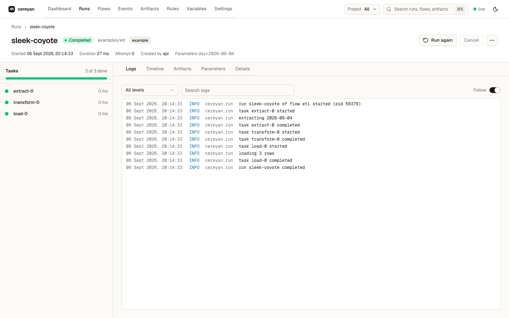

# Quickstart

In ten minutes you will write a pipeline, run it offline, serve it with a live UI, schedule it, make it retry, and backfill a date range.

## 1. Write a pipeline

Decorate plain functions. Parameters come from the type hints and are coerced before the flow runs.

```python
# pipeline.py
from datetime import date
from cereyan import flow, task, get_run_logger

@task
def extract(day: date) -> list[int]:
    get_run_logger().info("extracting %s", day)
    return [1, 2, 3]

@task
def load(rows: list[int]) -> int:
    return sum(rows)

@flow(run_name="etl-{day}")
def etl(day: date = date(2026, 9, 6)) -> int:
    return load(extract(day))

if __name__ == "__main__":
    print(etl())
```

A flow is still a function. Calling it runs the tasks in order, records a run with its task runs and logs, and returns the result:

```{.python continuation}
assert etl(day=date(2026, 1, 2)) == 6
```

## 2. Run it offline

<!-- notest: shell commands -->
```{.python notest}
python pipeline.py                                    # records a run in ~/.cereyan/db.sqlite
cereyan run pipeline.py:etl --param day=2026-01-02    # same, with parameters and a summary
cereyan runs ls --state Failed --json                 # inspect history
```

Nothing else is running. Every run lands in the local SQLite store, and `cereyan run` exits 0 on success, 1 on failure, 2 when nothing ran, and 3 on a loading or parameter error.

## 3. Serve it

<!-- notest: shell command that blocks -->
```{.python notest}
cereyan serve .          # imports every module under the directory, opens http://127.0.0.1:4200
```

One process now hosts the HTTP API, the web UI, the scheduler, and a warm pool of engine processes that execute runs. The dashboard shows runs and logs live. Scripts and `cereyan run` keep working while the server is up: they hand their run to the server and stream its logs back.



## 4. Schedule, retry, and write idempotent outputs

```python
from datetime import date
from cereyan import flow, task, Cron, LocalTarget, exponential

@task(output=lambda day: LocalTarget(f"out/{day}.parquet"), retries=2, retry_delay=exponential(1))
def build(day: date):
    with LocalTarget(f"out/{day}.parquet").open("w") as fh:
        fh.write("...")

@flow(schedule=Cron("0 9 * * *", timezone="Europe/Istanbul"), max_concurrent=1)
def daily(day: date = date(2026, 9, 6)):
    build(day)
```

- `schedule=` fires the flow every morning at nine in Istanbul once a server is running.
- `retries=2` with an exponential delay reruns `build` when it raises.
- `output=` names a target. When the file exists the task is skipped, so rerunning a day is safe.
- `max_concurrent=1` keeps two runs of `daily` from overlapping.

Run it twice: the second call skips `build` because its target exists.

```{.python continuation}
daily(date(2026, 1, 1))
daily(date(2026, 1, 1))   # build is Skipped: out/2026-01-01.parquet exists
```

## 5. Backfill a date range

With the server running:

<!-- notest: shell command against a running server -->
```{.python notest}
cereyan backfill daily --param day --start 2026-06-01 --end 2026-08-30 --concurrency 4
```

This creates one run per day, tagged `backfill:<id>`, with at most four executing at once. The Backfill dialog on the flow page does the same.

## 6. React to events

Rules run actions when events happen. A code rule is a decorated function:

```python
from cereyan import App, emit_event

app = App("warehouse")

@app.rule(on="run.failed", flow="check_orders")
def page_someone(event, run):
    print("failed:", run["name"])

@app.flow
def check_orders():
    emit_event("orders.table_empty", {"table": "orders"})

check_orders()
```

Rules can also be created in the UI with webhook, email, run-flow, cancel, set-state, and schedule actions, and a rule can fire when an expected event does *not* happen.

## Next

- Take the [tour of the UI](tour.md).
- Read the [concepts](../concepts/app-and-projects.md) for the model behind what you just did.
- Pick a guide: [retries and timeouts](../guides/retries-timeouts-crashes.md), [schedules](../guides/schedule-a-flow.md), [backfills](../guides/backfill.md), [rules](../guides/rules.md), or [using cereyan with an AI agent](../guides/agents.md).
