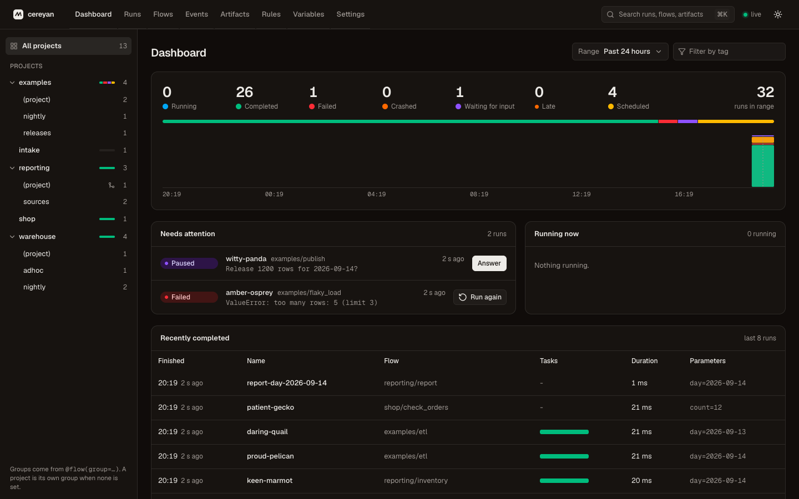
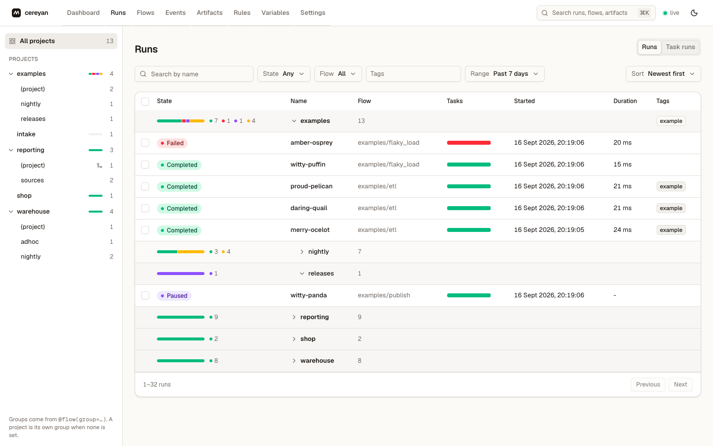
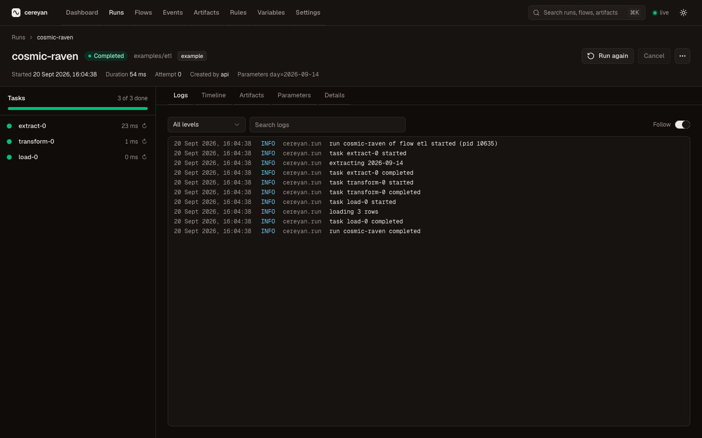
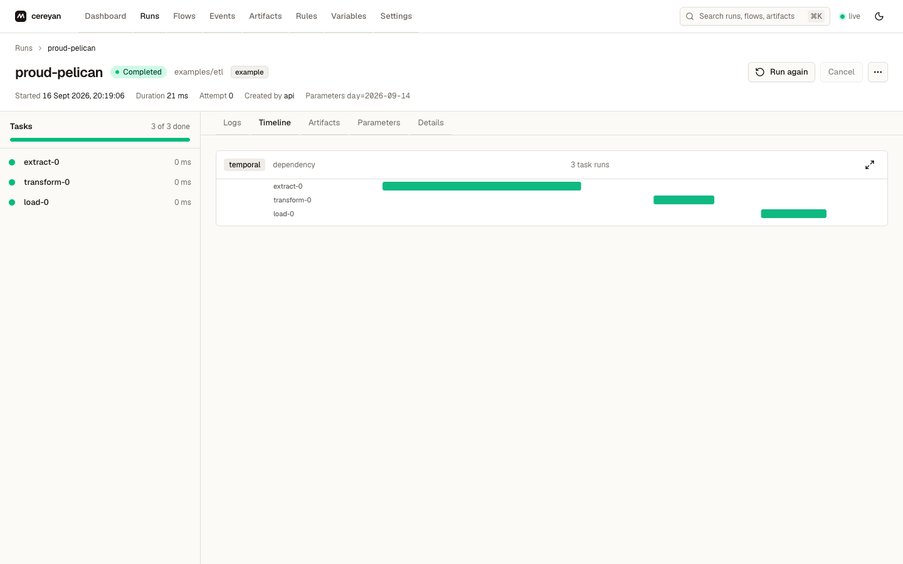
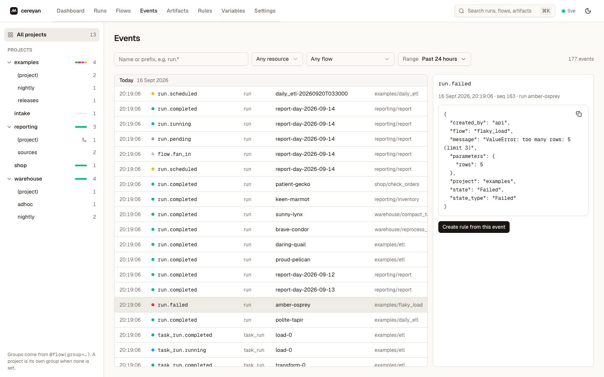
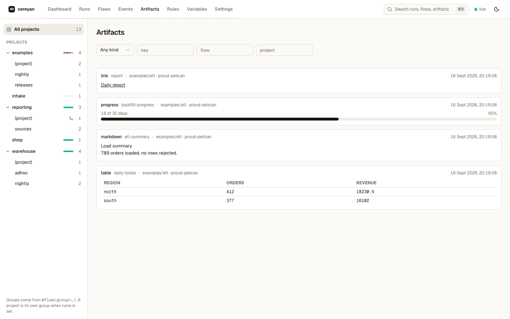
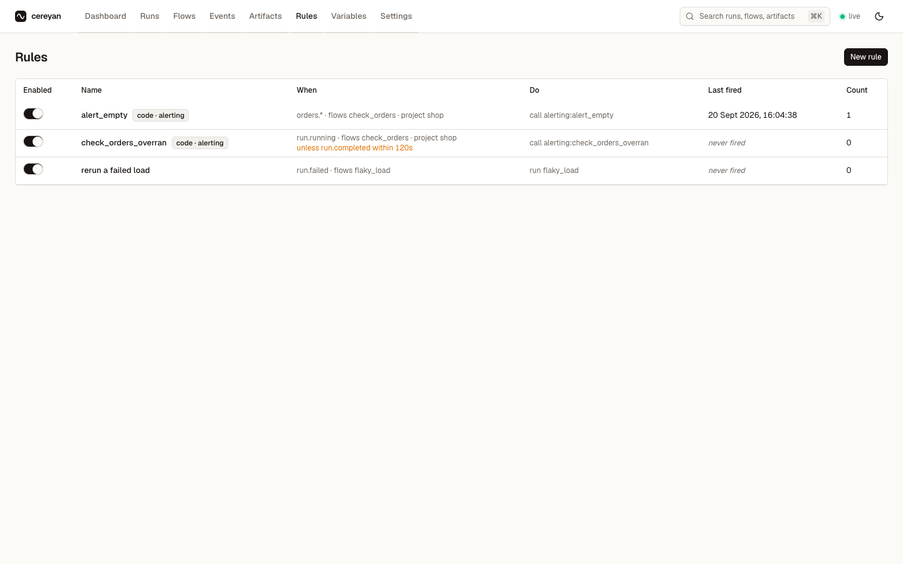
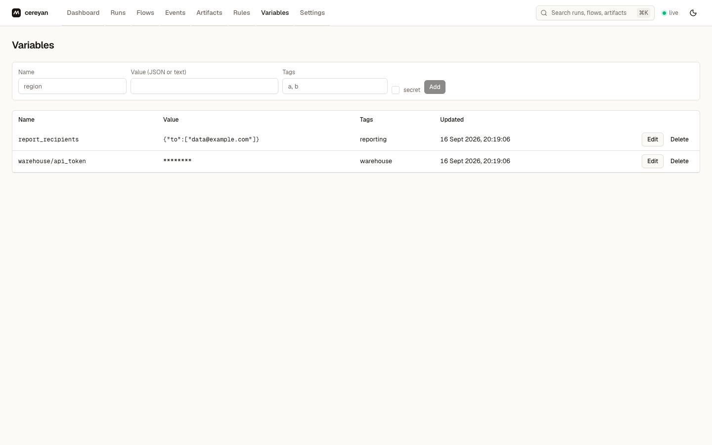
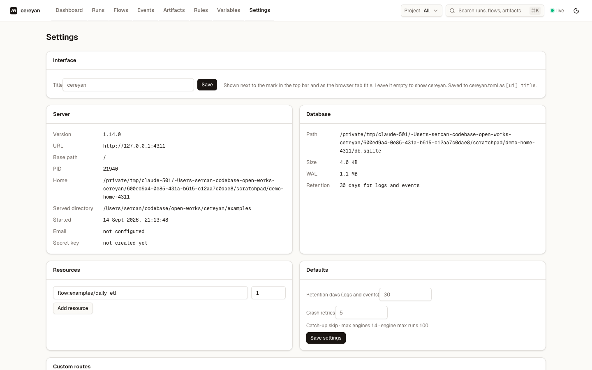

# Tour of the UI

`cereyan serve` opens the UI at `http://127.0.0.1:4200`. It is built for a desktop browser and updates live from the server's event stream. One top bar carries everything that is not a page: the eight sections (Dashboard, Runs, Flows, Events, Artifacts, Rules, Variables, and Settings), a **Project** switcher that scopes every list to one project, a search box (or **⌘K**, **Ctrl+K** elsewhere) that jumps to a section, a flow, a run by name, or an artifact by key, the connection indicator that reads **live** while the stream is connected, and the theme toggle.

The palette is a warm neutral in light and dark. Ink is the only brand colour; every other colour on a page belongs to a run state, so a glance tells you what is running, failed, waiting, or late.

## Dashboard

Counts for the selected range (Running, Completed, Failed, Crashed, Waiting for input, Late, Scheduled) with a proportion bar and a histogram by state across the width of its card. **Needs attention** lists the runs waiting on you: paused runs with their question and an **Answer** button, failed runs with **Run again**, crashed and late runs with **Open**. **Running now** shows each active run with its elapsed time and how many of its tasks are done. **Recently completed** lists the eight runs in the range that finished last, with when each finished, its task bar, duration, and parameters. **Upcoming** lists the next scheduled runs with a **Run now** shortcut. On a screen 1680 px wide or wider, Needs attention, Running now, and Upcoming sit side by side above Recently completed, and the histogram shows twice as many bars. The range selector and the tag filter apply to the whole page.

## Runs

Every run, newest first, in collapsible sections nested project then group. Filters are popover buttons for state, project, group, flow, tags, and range, plus a name search and a sort; the group options narrow to the selected project. The **Tasks** column is a bar of the run's task runs by state. The **Task runs** tab lists task runs across runs the same way. Selecting rows raises a bar at the bottom of the window with **Cancel** and **Delete** for the selection; a selection may span sections.

## Run detail

The header band shows the run's name, state, flow, tags, and a line with its start, elapsed or total time, attempt, what created it, and its parameters. **Run again** and **Cancel** sit on the right; **Delete** is in the overflow menu. A paused run shows its question and the **Resume** form in the band.

The **tasks rail** on the left lists every task run with its state, duration, and, for a task waiting to retry, the attempt and a countdown. Click a task to focus it: the **Logs** tab then shows only that task run's lines, with a chip you can clear. A task run also has a page of its own, opened from the **Task runs** tab of the runs page or from a bar on the Timeline, carrying its logs, artifacts, and details. The tabs on the right:

- **Logs**: log lines with a level filter, a search box, and **Follow** to keep the newest line in view while the run executes.
- **Timeline**: the task runs on a time axis, and a **dependency** view of the same graph.
- **Artifacts**: markdown, tables, progress bars, links, and images the run published.
- **Parameters**: the values the run was called with.
- **Details**: ids, timing, what created the run, its scheduled time, priority, attempt, the previous attempt, failure and crash counts, and the engine PID.

## Flows

Every flow the server has registered, in collapsible sections nested project then group. A flow's group is the one it declared with `group=`, else its project, so a flow that declared none is listed directly under its project rather than in a section repeating that name; a project header shows its source directory. A **Group** filter sits beside **Project**. Each row shows the schedule in words with the next fire time, the last ten runs as bars coloured by state and sized by duration, the last run's state, and tags. **Run** opens a form built from the flow's parameter schema. For a scheduled flow the row menu adds **Skip next run** (with the time it skips), **Skip runs…**, and **Reschedule…**, and the schedule cell counts skipped fires beside the next one. The **Dependencies** panel above the table draws each `after=` chain as nodes joined by arrows and each fan-in as its upstreams joined into the downstream flow with its key. A flow the running server did not register stays listed, dimmed, with its last-seen time and a **Delete** action.

A header at either level is the same columns rolled up, so collapsing hides the detail without hiding what it says: the soonest next fire, the recent runs, the last-run states as a bar with counts, the union of the tags, and how many flows it holds. A project's header covers every flow in it, across its groups, so a fold never hides what a group beneath it would have shown. Flows the running server no longer has registered are counted separately as **stale**, so an all-green bar cannot hide them. A section of more than five rows starts collapsed and everything else starts open; a lone section is always open, and a search opens every section it matches.

## Flow detail

The flow's description (rendered from its docstring), its schedule summary with the next fire that will run and how many are skipped, chips for priority, concurrency cap, and overlap policy, the last ten runs as dots, and **Run**, **Backfill**, **Skip next…**, and **Pause** actions, with **Reschedule** beside the schedule summary. Tabs list the runs; the upcoming runs, each with how far off it is and **Skip** or **Undo**, a skipped one saying who skipped it and when, several skippable at once or all from the header checkbox, and the fires past the look-ahead listed as projected, ten more at a time; the schedules with an editor and a preview of upcoming fire times; and the parameter schema.

## Events

The event feed, newest first, filling the page below its filters: by name or prefix such as `run.*`, by resource kind, by flow, and by time range. A row heads each day, and each event shows its time, a dot in the colour of the state its name ends in, its resource, its flow, and the start of its payload. Select an event to see its payload and a **Create rule from this event** button; on a screen 1440 px wide or wider that panel stays open beside the feed. New events appear as they happen.

## Artifacts

Artifacts across all runs, filtered by kind, key, flow, and project. Open a key to see its history: every value published under that key across runs, newest first.

## Rules

Every rule with its enabled switch, match clause, actions, last firing, and fire count. **New rule** opens the form: events, flows, tags, states, and project to match; the ordered actions; guards; and an **Unless** section for proactive rules. Code rules declared with `@app.rule` appear read-only with a `code` chip. Each rule's page lists its firings and open expectations and has a **Test** button that renders its templates against the most recent matching event without executing anything.

## Variables

Named JSON values with tags. Secrets are stored encrypted and shown masked. Values are shared by every project on the machine.

## Settings

Three tabs, the one open kept in the URL (`/settings?tab=data`), in a column at most 1080 px wide on the left so the forms stay readable on a wide screen.

| Tab | Shows |
|---|---|
| **General** | What you change: the title shown in the top bar and the browser tab, which names this installation (`[ui] title`; empty shows `cereyan`), resource totals, and the retention and crash-retry defaults; saving writes them back to `cereyan.toml`. What is running: the custom routes the served Apps registered, and the engine pool with each engine's PID, module, runs done, and current run. |
| **Environment** | The server's version, URL, PID, home, served directory, `cereyan.toml` path, Python, and platform; every setting with its value and where it came from (a flag, a `CEREYAN_*` variable, `app.serve()`, `cereyan.toml`, an edit in Settings, or the default); `cereyan.toml` itself; and the environment variables engines inherit. Secret values are hidden by the server and never reach the page. |
| **Data** | The database's path, size, and row counts; the projects in the store, with **Remove** on any this server does not serve; and **Reset database**. See [How to clean up the store](../guides/clean-up-the-store.md). |

Next: the [concepts](../concepts/app-and-projects.md), or straight to the [guides](../guides/retries-timeouts-crashes.md).
