# Tour of the UI

`cereyan serve` opens the UI at `http://127.0.0.1:4200`. It is built for a desktop browser and updates live from the server's event stream.

The **top bar** carries a search box (or **⌘K**, **Ctrl+K** elsewhere) that jumps to a section, a flow, a run by name, or an artifact by key, the connection indicator that reads **live** while the stream is connected, the theme toggle, and **New run**, which asks for a flow and then opens its run form.

The **sidebar** on the left lists the sections in four groups:

| Group | Sections |
|---|---|
| Operate | Dashboard, Runs, Queue (with how many runs are in line) |
| Build | Flows (with how many are in scope), Variables, Rules |
| Observe | Events, Artifacts, Workers (the Queue page's Workers tab) |
| System | Settings |

On Dashboard, Runs, Flows, Events, and Artifacts, the **scope picker** sits at the top of the sidebar. It names the scope and opens a list you can type into: **All projects**, then every project with a bar of its flows' last-run states and its flow count, and under each project its groups, marked when their flows have upstream dependencies. A project with both its own flows and groups lists its own flows as **Ungrouped flows**. Picking an entry scopes the page and is kept across reloads: Runs and Flows narrow to the group, and Dashboard, Events, and Artifacts to its project. A link carrying `?project=` or `?group=` overrides the picker for that page. How projects and groups are declared is in [How to organise flows into projects and groups](../guides/organise-projects-and-groups.md).

The palette is a warm neutral in light and dark. Ink is the only brand colour; every other colour on a page belongs to a run state, so a glance tells you what is running, failed, waiting, or late.

## Dashboard

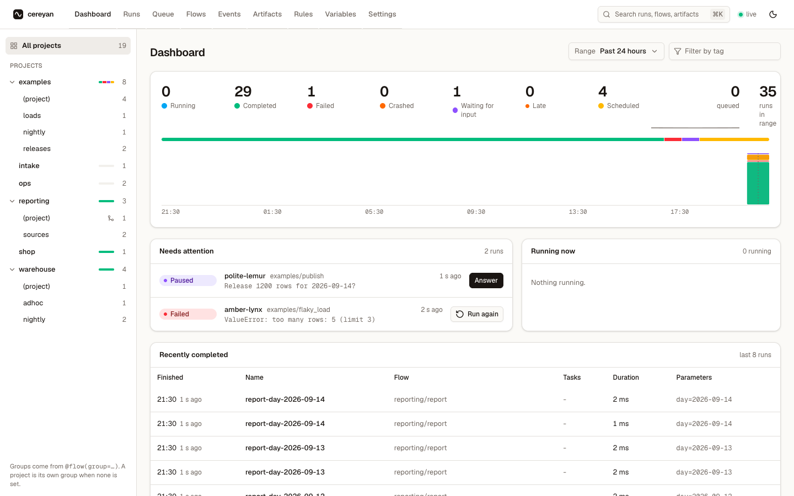

The range selector and the tag filter apply to the whole page. From the top:

- **Counts** for the range: Completed, Failed, Waiting for input, and Scheduled always, Running, Crashed, and Late only when there are any, and the total, over a histogram by state across the width of the card. On a screen 1680 px wide or wider the histogram shows twice as many bars.
- **Flows**: up to eight flows that have run, failing ones first, each with its last run's state and duration, its next scheduled run, and its last ten runs as squares coloured by state. Click a square to read that run's logs in the card without leaving the page; the newest failed run is open when the page loads. Click it again or **✕** to close it, or **Open run** for the full run page. A run name in Recently completed opens its logs the same way.
- **Upcoming**: the next three runs due, with when and why, and a link to the Queue page for the rest.
- **Needs attention**: the runs waiting on you, up to five: paused runs with their question and an **Answer** button, failed and crashed runs with **Run again**, late runs with **Open**. **Show all** lists the rest on the Runs page.
- **Running now**: each active run with its elapsed time and how many of its tasks are done, or how many processors are idle.
- **Recently completed**: the eight runs in the range that finished last, with their flow, when each finished, and its duration.

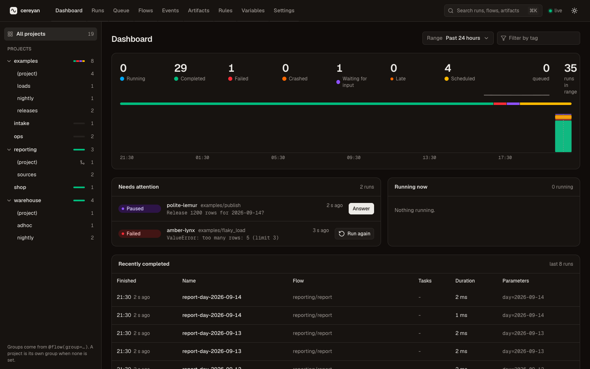

## Runs

Every run in the picker's scope, newest first, in collapsible sections nested project then group. Filters are popover buttons for state and flow, a tag field, range, a name search, a `param=value` search over run parameters, and a sort; a row above the table cancels, reruns, or deletes every run the filters match, after showing how many; the flow options narrow to the flows in scope. The **Tasks** column is a bar of the run's task runs by state. The **Task runs** tab lists task runs across runs the same way. Selecting rows raises a bar at the bottom of the window with **Cancel** and **Delete** for the selection; a selection may span sections.

## Run detail

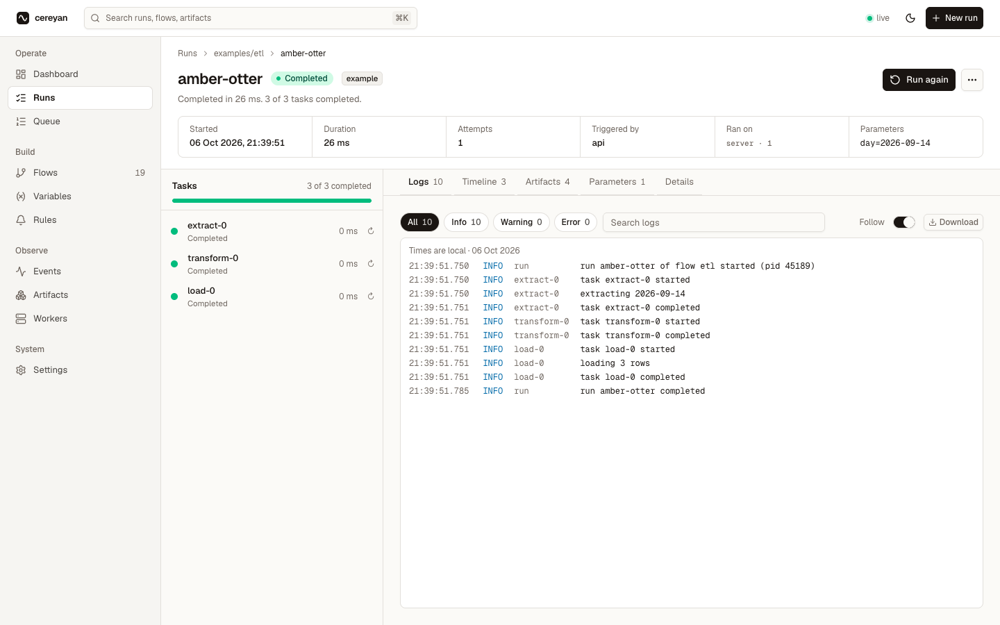

The header band shows the run's name, state, flow, and tags, and one sentence saying how it went, such as "Failed after 41 ms on the 2nd attempt. 2 of 3 tasks completed." Below it, labelled cells give its start, elapsed or total time, attempts, what created it, where it ran (the server or a worker's name with the processor slot, linking to the Workers tab), and its parameters. **Run again** sits on the right, with **Retry from failure** for a failed, crashed, or cancelled run and **Cancel** only while the run has not finished; **Delete** is in the overflow menu. A failed or crashed run shows a card with the failing task and its error, and **Show in logs** jumps to the first error line. A paused run shows its question, or the topic it waits for a message on, and the **Resume** form in the band; a run sleeping or waiting for an event or a target says so, with **Wake now**.

The **tasks rail** on the left lists every task run with its state in words, duration, and, for a task waiting to retry, the attempt and a countdown. Click a task to focus it: the **Logs** tab then shows only that task run's lines, with a chip you can clear. A task run also has a page of its own, opened from the **Task runs** tab of the runs page or from a bar on the Timeline, carrying its logs, artifacts, and details. The tabs on the right:

- **Logs**: log lines with the time of day under a date heading, level chips that count the lines at each level, a search box, **Download**, and **Follow** to keep the newest line in view while the run executes.
- **Timeline**: the task runs on a time axis, and a **dependency** view of the same graph.
- **Artifacts**: markdown, tables, progress bars, links, and images the run published.
- **Parameters**: the values the run was called with.
- **Details**: ids, timing, what created the run, its scheduled time, priority, attempt, the previous attempt, failure and crash counts, and the engine PID.

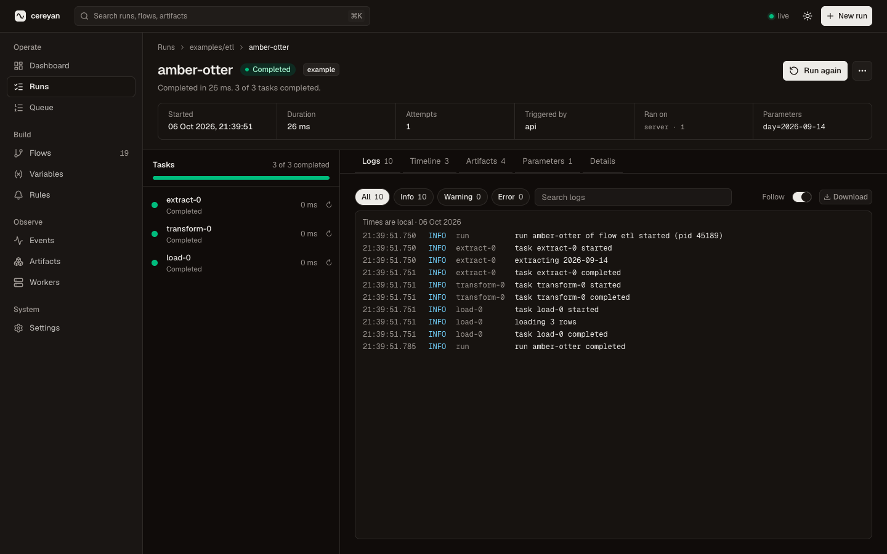

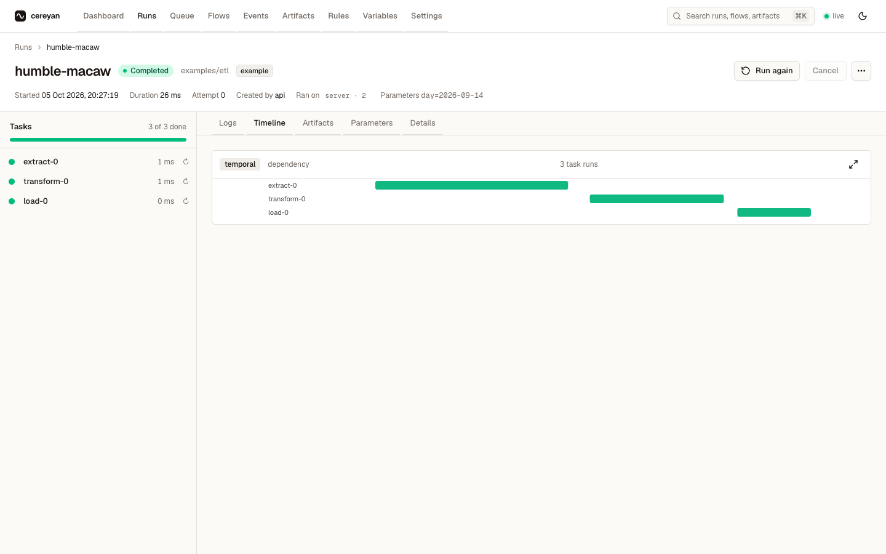

## Queue

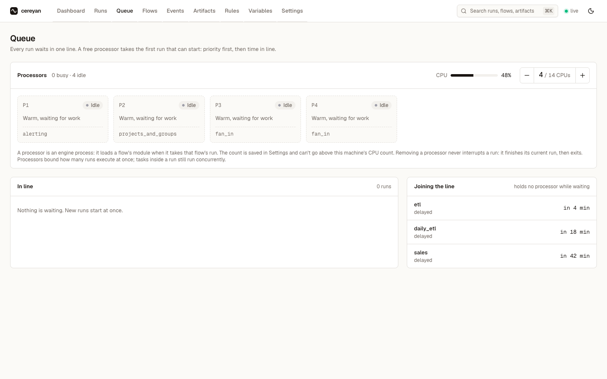

The one line every run waits in, whatever created it. A line at the top says how many runs are executing and waiting.

- **Capacity**: how many processors are busy, the machine's CPU use, and the queue depth over the last hour. **+** and **−** add or remove processors while the server runs, and a removed processor finishes its run first. Each processor is a slot, grouped by host: running with its run, flow, and task, idle with the module it has loaded, or draining.
- **Up next**: **Ready to start** lists the runs in line in dispatch order, with why each can or cannot start yet and how many went ahead of it. **Starting later** lists the runs due in the next hour, including the waiting run of each continuous schedule with a switch to pause or resume its loop; none of them holds a processor.
- **How the queue works** opens a short explanation of the line.

The **Workers** tab lists every remote worker with its status, host details, labels, version, the modules whose code differs from the server's, a six-hour schedule per processor, and **Drain**, **Resume**, and **Forget worker**. How the queue orders runs is in [Engines and the home directory](../concepts/engines-and-home.md#processors-and-the-queue), and workers in [How to run across machines](../guides/run-across-machines.md).

## Flows

The flows in the picker's scope. The title names the scope (**All flows**, a project, or a group) over a line with its flow and group counts, how many are failing or waiting for input, and the source directory. Above the table, a search, the chips **All**, **Failing**, **Scheduled**, **Waiting for input**, and **Never run**, and a **Tags** filter narrow within the scope. Each count is taken over the whole scope, and the filters reset when the scope changes. **Clear** removes them, and the count reads `n of m flows` while they apply.

While the scope spans more than one group, a band heads each project and group with its flow count, how many are scheduled, whether its flows have dependencies, and how many are **stale**, meaning not registered by this server. Click a band's name to scope to that group. Scope to a single group and a summary strip replaces the bands: its flow count, the soonest next fire, its last-run states with the stale count, and each dependency as `upstream → flow`.

Each row shows the flow's name with a line under it for its description, the flows it starts after, its tags, and its health check in words; the schedule in words with the next fire time; the last ten runs as squares coloured by state, with a legend above the table; and the last run's state. **Run** opens a form built from the flow's parameter schema. For a scheduled flow the row menu adds **Skip next run** (with the time it skips), **Skip runs…**, and **Reschedule…**, and the schedule cell counts skipped fires beside the next one. A flow the running server did not register stays listed, dimmed, with its last-seen time and a **Delete** action.

## Flow detail

The flow's description (rendered from its docstring), its schedule summary with the next fire that will run and how many are skipped, chips for priority, concurrency cap, and overlap policy, the last ten runs as dots, and **Run**, **Backfill**, **Skip next…**, and **Pause** actions, with **Reschedule** beside the schedule summary. Tabs list the runs; the upcoming runs, each with how far off it is and **Skip** or **Undo**, a skipped one saying who skipped it and when, several skippable at once or all from the header checkbox, and the fires past the look-ahead listed as projected, ten more at a time; the schedules with an editor (Cron, Interval, RRule, or Continuous) and a preview of upcoming fire times; and the parameter schema. A continuous schedule shows where its loop is, running or waiting for its delay, with **Join the line now** to move the waiting run to now.

## Events

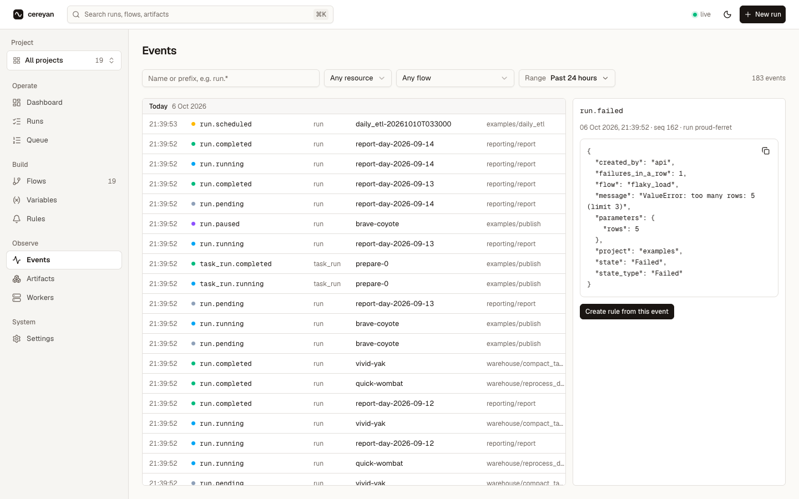

The event feed, newest first, filling the page below its filters: by name or prefix such as `run.*`, by resource kind, by flow, and by time range. A row heads each day, and each event shows its time, a dot in the colour of the state its name ends in, its resource, its flow, and the start of its payload. Select an event to see its payload and a **Create rule from this event** button; on a screen 1440 px wide or wider that panel stays open beside the feed. New events appear as they happen.

## Artifacts

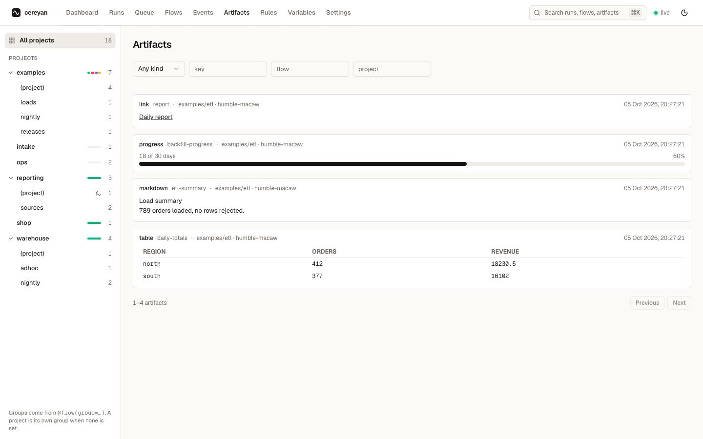

Artifacts across all runs, filtered by kind, key, flow, and project. Open a key to see its history: every value published under that key across runs, newest first.

## Rules

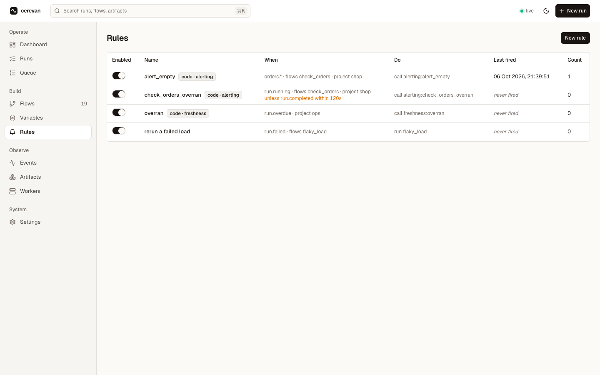

Every rule with its enabled switch, match clause, actions, last firing, and fire count. **New rule** opens the form: events, flows, tags, states, and project to match; the ordered actions; guards; and an **Unless** section for proactive rules. Code rules declared with `@app.rule` appear read-only with a `code` chip. Each rule's page lists its firings and open expectations and has a **Test** button that renders its templates against the most recent matching event without executing anything.

## Variables

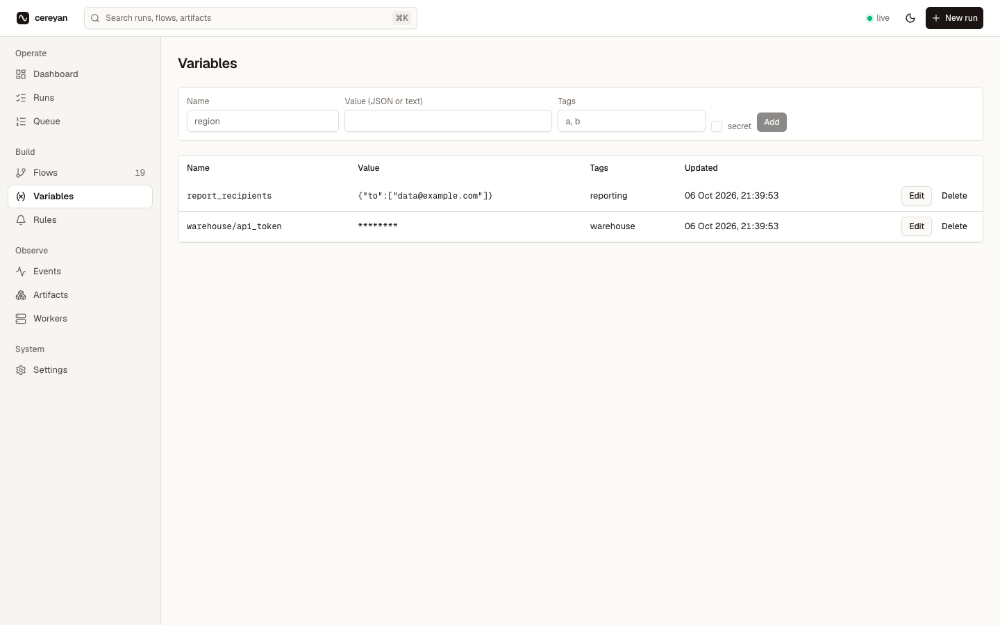

Named JSON values with tags. Secrets are stored encrypted and shown masked. Values are shared by every project on the machine.

## Settings

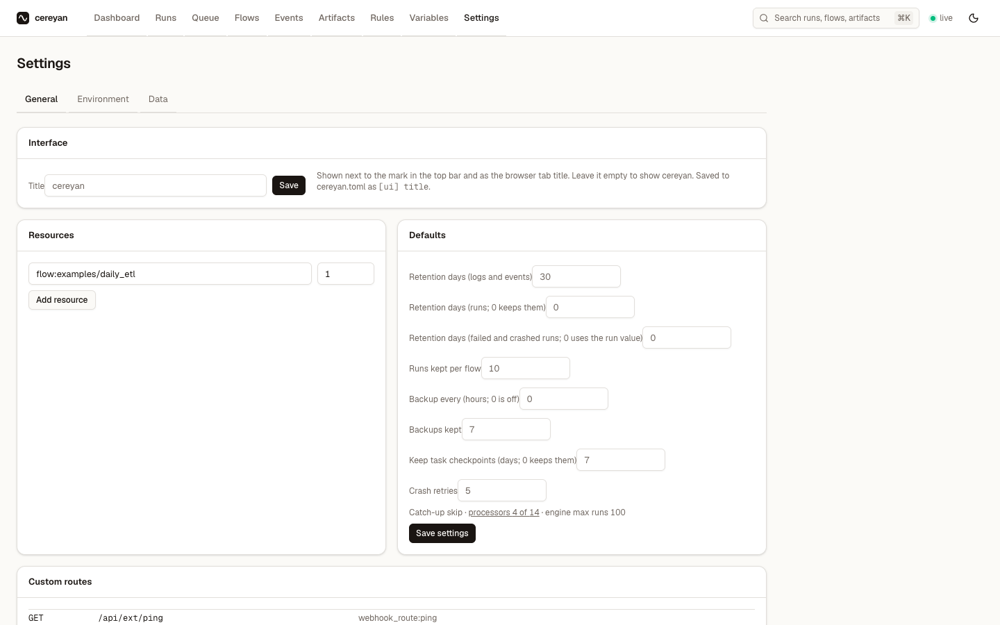

Three tabs, the one open kept in the URL (`/settings?tab=data`), in a column at most 1080 px wide on the left so the forms stay readable on a wide screen.

| Tab | Shows |
|---|---|
| **General** | What you change: the title shown in the top bar and the browser tab, which names this installation (`[ui] title`; empty shows `cereyan`), resource totals, and the retention and crash-retry defaults; saving writes them back to `cereyan.toml`. What is running: the custom routes the served Apps registered, and the engine pool with each engine's PID, module, runs done, and current run. |
| **Environment** | The server's version, URL, PID, home, served directory, `cereyan.toml` path, Python, and platform; every setting with its value and where it came from (a flag, a `CEREYAN_*` variable, `app.serve()`, `cereyan.toml`, an edit in Settings, or the default); `cereyan.toml` itself; and the environment variables engines inherit. Secret values are hidden by the server and never reach the page. |
| **Data** | The database's path, size, and row counts; the projects in the store, with **Remove** on any this server does not serve; and **Reset database**. See [How to clean up the store](../guides/clean-up-the-store.md). |

Next: the [concepts](../concepts/app-and-projects.md), or straight to the [guides](../guides/retries-timeouts-crashes.md).
