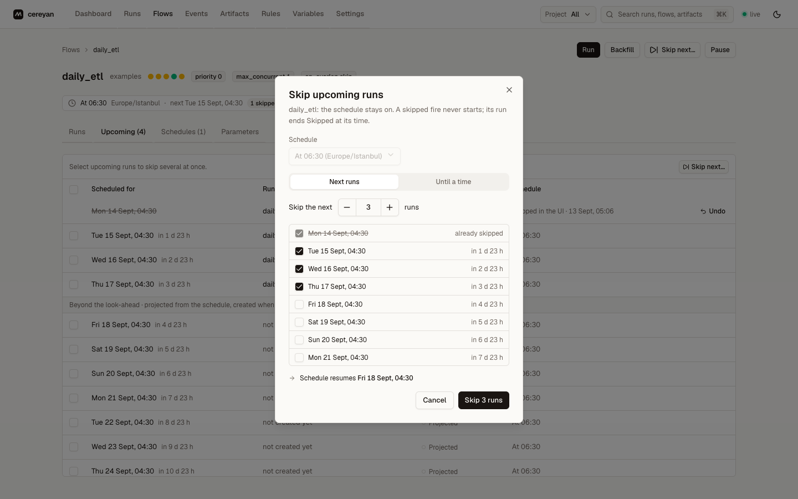

# How to schedule a flow

Add `schedule=` to the flow and serve it. The server creates runs at each fire time; nothing fires offline.

## Declare the schedule in code

```python
from datetime import date, timedelta
from cereyan import flow, Cron, Interval

@flow(schedule=Cron("30 6 * * *", timezone="Europe/Istanbul"))
def morning_load(day: date = date.today()) -> str:
    return str(day)

@flow(schedule=Interval(timedelta(minutes=15)), max_concurrent=1, on_overlap="skip")
def poll_queue() -> None:
    ...

assert morning_load.schedules[0]["kind"] == "cron"
assert poll_queue.schedules[0]["interval"] == 900
```

Then:

<!-- notest: shell command that blocks -->
```{.python notest}
cereyan serve pipelines/
```

The flow page shows the schedule summary and next fire time, the **Upcoming** tab lists the runs materialised ahead, and the dashboard's Upcoming panel shows the next fires across flows.

## Pick the kind

| Want | Declare |
|---|---|
| Wall-clock times | `Cron("0 9 * * 1-5", timezone="Europe/Istanbul")` |
| Every N seconds or minutes | `Interval(timedelta(minutes=15))`; add `anchor=datetime(...)` to align the grid |
| Calendar rules | `RRule("DTSTART:20260101T090000\nRRULE:FREQ=MONTHLY;BYDAY=-1FR", timezone="UTC")` |

Several schedules can be given as `schedules=[...]`. Each takes `catchup` (`skip`, `latest`, `all`) and `catchup_max` for what happens to fires missed while the server was down.

## Keep runs from piling up

A slow flow on a fast schedule needs a policy. `max_concurrent=1` with `on_overlap="skip"` drops a fire while the previous run is still going; `"enqueue"` (the default) lets it wait; `"cancel_new"` records it as cancelled. See [Limit concurrency and overlap](resources-and-overlap.md).

## Pause and resume

Pause from the flow page, `POST /api/schedules/{id}/pause`, the MCP `pause_schedule` tool, or a rule's `pause_schedule` action. Pausing removes the schedule's not-yet-started runs; resuming materialises them again. `disable_after=(count, window, persist)` pauses automatically after repeated failures.

## Skip a run

To stop one run without pausing the schedule, open the flow's menu on the Flows page: **Skip next run** skips the next fire, and **Skip runs…** opens a checklist of upcoming fires filled by a *Skip the next N* stepper or an *Until a time* field, with the time the schedule resumes and the flows after this one that are skipped too.



The flow page's **Upcoming** tab does the same row by row, for several rows at once, or for all of them with the header checkbox, and lists fires past the materialised runs as projected so you can skip one days ahead. A skipped fire shows who skipped it and when; at its time it ends `Skipped` without starting, and so do the runs of the flows declared `after=` it. **Undo** takes a skip back until its time. See [Skipping fires](../concepts/schedules.md#skipping-fires).

## Inspect through the API

```{.python fixture:served}
flow = next(f for f in served.client.flows() if f["name"] == "daily_etl")
schedules = served.client.schedules(flow["id"])
assert schedules and schedules[0]["schedule"]["kind"] == "cron"
upcoming = served.client.upcoming(flow["id"])
assert len(upcoming) >= 1
```

## Edit at runtime

**Reschedule…**, in the Flows page menu and beside the schedule summary on the flow page, edits a cron schedule as a daily, weekly, or monthly time in a timezone, or as raw cron, with its catch-up options, and shows the coming week before and after the change with what saving replaces and the skips it would drop.


Interval and RRule schedules open in the Schedules tab's editor, which previews the next fire times (`POST /api/schedules/preview`). An edit to a code-declared schedule lasts until the next restart re-applies the declaration, unless the request sets `persist: true`.

Related: [Schedules](../concepts/schedules.md), [Backfill a date range](backfill.md).
