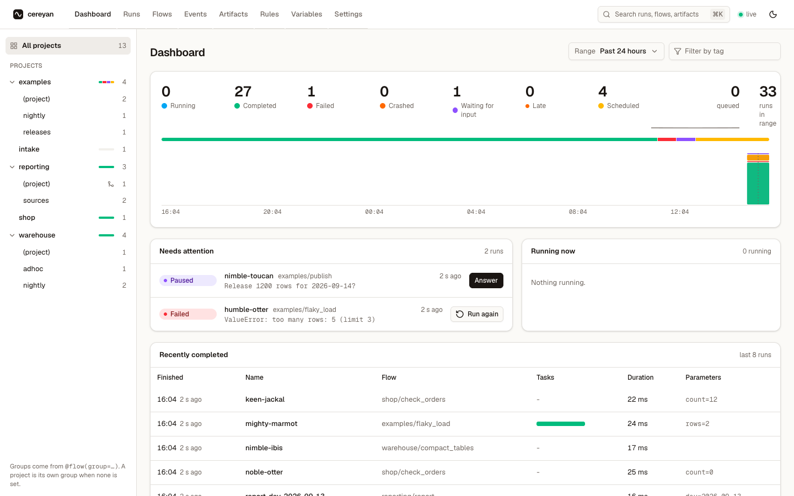

# cereyan

Cereyan is a minimal, local-first orchestrator for Python data pipelines. A Rust core (SQLite store, state machine, scheduler, HTTP server) sits behind a thin layer of Python decorators, and the whole thing ships as one wheel with no runtime dependencies.

```python
from datetime import date
from cereyan import flow, task

@task
def extract(day: date) -> list[int]:
    return [1, 2, 3]

@flow(run_name="etl-{day}")
def etl(day: date) -> int:
    return sum(extract(day))

assert etl(date(2026, 9, 6)) == 6   # recorded as a run in ~/.cereyan/db.sqlite
```

- **Offline first.** `python pipeline.py` records runs into a local SQLite file. Nothing else needs to run.
- **One process to serve.** `cereyan serve dir/` hosts the API, the UI, the scheduler, a warm pool of engine processes, and a built-in MCP server for agents.
- **Data-pipeline semantics.** Targets make reruns idempotent, backfills cover date ranges, resources are named semaphores, flows chain and fan in by key, and rules react to events or to their absence.



## Where to go

<div class="grid cards" markdown>

- **[Quickstart](get-started/quickstart.md)**

    From `pip install` to a scheduled, retried, backfilled pipeline in ten minutes.

- **[Concepts](concepts/app-and-projects.md)**

    The model: App, flow, task, run, state, schedule, target, resource, backfill, artifact, variable, event, rule.

- **[Guides](guides/retries-timeouts-crashes.md)**

    One goal per page, from retries to running the server as a service.

- **[Reference](reference/python-api.md)**

    Every option, command, route, event, state, and configuration key.

</div>

Agents can read the whole site as one file: [llms.txt](https://sercanatalik.github.io/cereyan/llms.txt) is the index and [llms-full.txt](https://sercanatalik.github.io/cereyan/llms-full.txt) is the full text.
